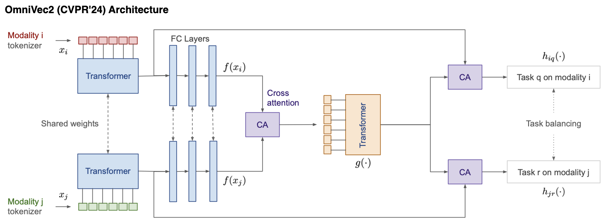
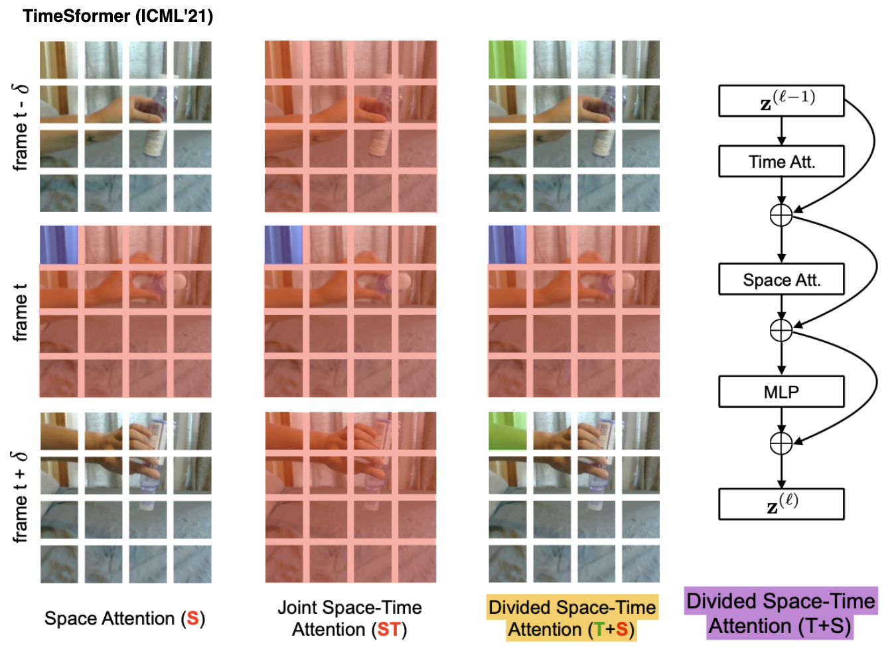
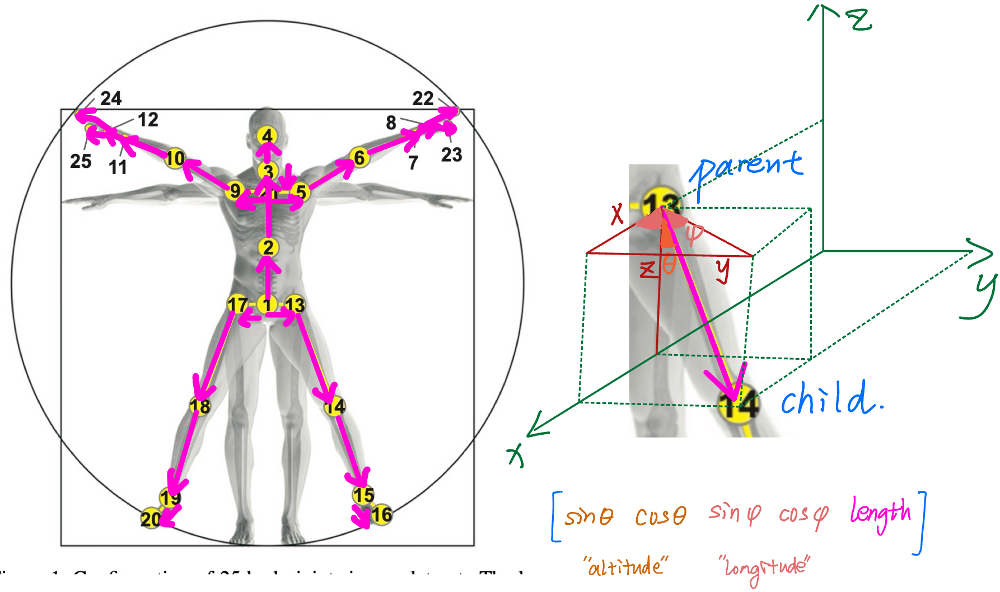

# 🌊 CascadeFormer: Two-stage Cascading Transformer for Human Action Recognition

## CascadeFormer 1.X series

## Architecture inspiration from OmniVec2 (CVPR'24)

**Tokenization** matters! OmniVec2 uses TimeSformer, where each patch attends the same patch across all frames and other patches within the same frame:

Conclusion: we perhaps need to do 'smart' **joint** embedding like this instead of frame embedding 

## biomechanics-aware frame embedding 

## Reproduce HyperFormer (2022)
 
| most-active-person (B, T, V, C) | two-person (B, C, T, V, M) | official paper's report |
| ------------------ | ---------- | --------------- |
| 87.04% | 90.57% | 92.9% |

## Leaderboard

| dataset | #videos | #joints | CF 1.0 | CF 1.1 | CF 1.2 | CF 1.3 | CF 1.4 |
| ------- | ------- | ---------- | ------ | ------- | ------ | ------- | ------- |
| Penn Action | 2,326 | 13, 2D | **94.66%** [checkpoint](https://drive.google.com/drive/folders/1Za50ZE9ZEKdEps_ZE-JIbatTpLuMW83k) | **94.10%** [checkpoint](https://drive.google.com/drive/folders/1qbcT8DlhNyT3HgbM3j2aEQP2rSXoEJRS) | **94.10%** [checkpoint](https://drive.google.com/drive/folders/1Jl7lIVcbqw6W2xzvf09nVRERXHIFrjXn) | N/A | N/A | 
| N-UCLA | 1,494 | 20, 3D | **89.66%** [checkpoint](https://drive.google.com/drive/folders/1ncVqXBd2P-SMDD_OCZaGyEti2LVfwiw8) | **91.16%** [checkpoint](https://drive.google.com/drive/folders/1b0IuO_XY-Gwv4RjS6gF9gPG36uvGwhha) | **90.73%** [checkpoint](https://drive.google.com/drive/folders/1IPSW5pz_Sn0dfywP2RatlnlrfVzPJNvB) | N/A | N/A |
| NTU/CS | 56,880 | 25, 3D | **81.01%** [checkpoint](https://drive.google.com/drive/folders/1eKcX4wE6UweV0EviHUPzltzivjYAHjeI) | **79.62%**[checkpoint](https://drive.google.com/drive/folders/1Tf0cpzBpg8bg7M1LpxHla40Fcdvp27DY) | TBD | TBD | N/A |
| NTU/CV | 56,880 | 25, 3D | **88.17%** [checkpoint](https://drive.google.com/drive/folders/1-VrOyJKEvCQig_S4HM4Tdae9S3Tsc5M_) | N/A | N/A | N/A | N/A |

## Tuning Diagram

## Ablation Study: bone representation (Penn Action and NTU/CS)

| dataset | #videos | #actions | dimension | #joints | outperform SoTA? |
| ------- | ------- | -------- | --------- | ---------- | ------- |
| Penn Action, subtraction-bone | 2,326 | 15 | 2D | 13 | **92.32%** ~ 93.4% (HDM-BG) |
| Penn Action, concatenation-bone | 2,326 | 15 | 2D | 13 | **93.16%** ~ 93.4% (HDM-BG) |
| Penn Action, parameterization-bone | 2,326 | 15 | 2D | 13 | **93.91%** > 93.4% (HDM-BG) |
| N-UCLA, subtraction-bone | 1,494 | 12 | 3D | 20 | **85.56%** < 98.3% (SkateFormer) |
| N-UCLA, concatenation-bone | 1,494 | 12 | 3D | 20 | **88.15%** < 98.3% (SkateFormer) |
| NTU/CS, subtraction-bone | 56,880 | 60 | 3D | 25 | **74.23%** << 92.6% (SkateFormer) - cross subject |
| NTU/CS, concatenation-bone | 56,880 | 60 | 3D | 25 | **73.81%** << 92.6% (SkateFormer) - cross subject |

## CascadeFormer 2.0 (interleaved spatial–temporal attention inspired by [IIP-Transformer](https://arxiv.org/abs/2110.13385) and [ST-TR](https://arxiv.org/abs/2012.06399))  

### result leaderboard - CascadeFormer 2.0

| dataset | #videos | #actions | dimension | #joints | outperform SoTA? |
| ------- | ------- | -------- | --------- | ---------- | ------- |
| Penn Action | 2,326 | 15 | 2D | 13 | **92.32%** = 93.4% (HDM-BG) |
| N-UCLA | 1,494 | 12 | 3D | 20 | 98.3% (SkateFormer) |
| NTU/CS | 56,880 | 60 | 3D | 25 | 92.6% (SkateFormer) |
| NTU/CV | 56,880 | 60 | 3D | 25 | 92.6% (SkateFormer) |

corresponding model checkpoints:

1. Penn Action: **92.32%** [google drive](https://drive.google.com/drive/folders/1cYQMhedWKBm93L9RWSEAj2HYGhdlucKl) - for Penn Action at least, it's very sensitive to overfitting! (sometimes fail to converge too...)
2. N-UCLA: TBD
3. NTU/CS: TBD
4. NTU/CV: TBD
