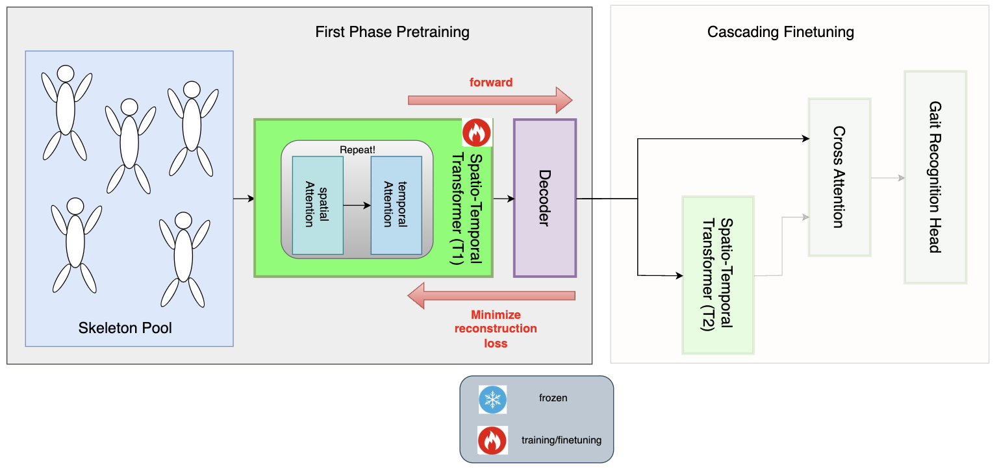
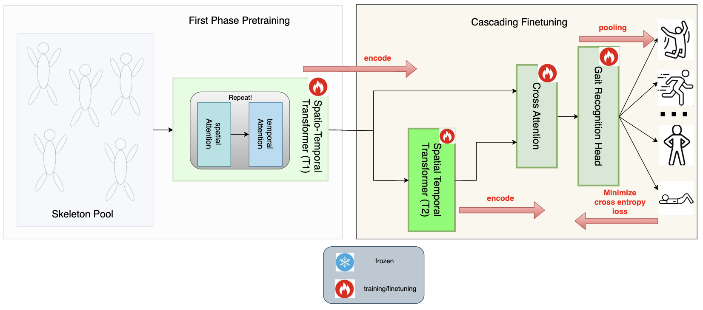

# 🌊 CascadeFormer: Two-stage Cascading Transformer for Human Action Recognition

## Important Updates

NTU Grid search summary, for CascadeFormer 1.1 (with convolution):

1. layers (fix hidden size = 512, heads = 8): 8 layers: 73.07%; 12 layers: 73.97%
2. hidden size (fix layers = 8, heads = 8): 512: 73.97%; 768: 73.48%; 1024: 73.61%

potential strategies (other than optimizing the model architecture) to bridge the **performance** gap for NTU:

3. label smoothing [not tried yet]
4. tune "trimmed-uniform random sampling" [now only 64 frames, no trimmed yet]

## CascadeFormer 1.0

Pretraining:

Cascading Finetuning:

### result leaderboard - CascadeFormer 1.0

| dataset | #videos | #actions | dimension | #joints | outperform SoTA? |
| ------- | ------- | -------- | --------- | ---------- | ------- |
| Penn Action | 2,326 | 15 | 2D | 13 | **94.66%** > 93.4% (HDM-BG) |
| N-UCLA | 1,494 | 12 | 3D | 20 | **88.79%** < 98.3% (SkateFormer) |
| NTU/CS | 56,880 | 60 | 3D | 25 | **75.22%** << 92.6% (SkateFormer) - cross subject |
| <tr><td colspan="6" align="center"> **Bone** data representation ablation study </td></tr> |
| Penn Action, subtraction-bone | 2,326 | 15 | 2D | 13 | **92.32%** ~ 93.4% (HDM-BG) |
| Penn Action, concatenation-bone | 2,326 | 15 | 2D | 13 | **93.16%** ~ 93.4% (HDM-BG) |
| Penn Action, parameterization-bone | 2,326 | 15 | 2D | 13 | **93.91%** > 93.4% (HDM-BG) |
| N-UCLA, subtraction-bone | 1,494 | 12 | 3D | 20 | **85.56%** < 98.3% (SkateFormer) |
| N-UCLA, concatenation-bone | 1,494 | 12 | 3D | 20 | **88.15%** < 98.3% (SkateFormer) |
| NTU/CS, subtraction-bone | 56,880 | 60 | 3D | 25 | **74.23%** << 92.6% (SkateFormer) - cross subject |
| NTU/CS, concatenation-bone | 56,880 | 60 | 3D | 25 | **73.81%** << 92.6% (SkateFormer) - cross subject |

corresponding model checkpoints:

1. Penn Action: **94.66%** [google drive](https://drive.google.com/drive/folders/1Za50ZE9ZEKdEps_ZE-JIbatTpLuMW83k)
2. N-UCLA: **88.79%**
3. NTU/CS: **75.22%**
4. NTU/CV: TBD

## CascadeFormer 1.1 (convolution enhanced)

Pretraining:

Cascading Finetuning:

### result leaderboard - CascadeFormer 1.1

| dataset | #videos | #actions | dimension | #joints | outperform SoTA? |
| ------- | ------- | -------- | --------- | ---------- | ------- |
| Penn Action | 2,326 | 15 | 2D | 13 | **94.10%** > 93.4% (HDM-BG) |
| N-UCLA | 1,494 | 12 | 3D | 20 | **91.16%** < 98.3% (SkateFormer) |
| NTU/CS | 56,880 | 60 | 3D | 25 | **72.22%** << 92.6% (SkateFormer) |
| NTU/CV | 56,880 | 60 | 3D | 25 | ??? << 92.6% (SkateFormer) |

corresponding model checkpoints:

1. Penn Action: **94.10%** [google drive](https://drive.google.com/drive/folders/1qbcT8DlhNyT3HgbM3j2aEQP2rSXoEJRS)
2. N-UCLA: **91.16%** [google drive](https://drive.google.com/drive/folders/1b0IuO_XY-Gwv4RjS6gF9gPG36uvGwhha); **90.52%** [google drive](https://drive.google.com/drive/folders/10v1zGGhziiRZdXO2mDU-db_keVmmeUNY) 
3. NTU/CS: **74.10%**
4. NTU/CV: TBD

## CascadeFormer 1.2 (spatial-transformer enhanced)

Spatial transformer: reshape input into (BxT, J, D) instead of (B, T, JxD)

Pretraining:

Cascading Finetuning:

### result leaderboard - CascadeFormer 1.2

| dataset | #videos | #actions | dimension | #joints | outperform SoTA? |
| ------- | ------- | -------- | --------- | ---------- | ------- |
| Penn Action | 2,326 | 15 | 2D | 13 | **94.10%** > 93.4% (HDM-BG) |
| N-UCLA | 1,494 | 12 | 3D | 20 | **90.73%** < 98.3% (SkateFormer) |
| NTU/CS | 56,880 | 60 | 3D | 25 | 92.6% (SkateFormer) |
| NTU/CV | 56,880 | 60 | 3D | 25 | 92.6% (SkateFormer) |

corresponding model checkpoints:

1. Penn Action: **94.10%** [google drive](https://drive.google.com/drive/folders/1Jl7lIVcbqw6W2xzvf09nVRERXHIFrjXn), **94.01%** [google drive](https://drive.google.com/drive/folders/1jAlH7pf-zaHy7CVIF3MAmiZ5mMtDw2j-)
2. N-UCLA: **90.73%** [google drive](https://drive.google.com/drive/folders/1IPSW5pz_Sn0dfywP2RatlnlrfVzPJNvB)
3. NTU/CS: TBD
4. NTU/CV: TBD

## CascadeFormer 2.0 (interleaved spatial–temporal attention inspired by [IIP-Transformer](https://arxiv.org/abs/2110.13385) and [ST-TR](https://arxiv.org/abs/2012.06399))  

Pretraining:

Cascading Finetuning:

1. initial data: (B, T, J, D)
2. joint embedding🔥: **instead of (B, T, d_model), use (B, T, J, d_model // J)** - embedding for each specific joint!
3. spatial attention: attention on (B*T, J, d_model // J) - attending joints, don't care which frame it is in
4. temporal attention: attention on (B * J, T, d_model // J) - attending frames, don't care which joint it is
5. flatten (B, T, J, d_model // J) - (B, T, d_model) for autoencoding (reconstruction head); convert it back to (B, T, J, d_model // J) to proceed in T2

### result leaderboard - CascadeFormer 2.0

| dataset | #videos | #actions | dimension | #joints | outperform SoTA? |
| ------- | ------- | -------- | --------- | ---------- | ------- |
| Penn Action | 2,326 | 15 | 2D | 13 | **92.32%** = 93.4% (HDM-BG) |
| N-UCLA | 1,494 | 12 | 3D | 20 | 98.3% (SkateFormer) |
| NTU/CS | 56,880 | 60 | 3D | 25 | 92.6% (SkateFormer) |
| NTU/CV | 56,880 | 60 | 3D | 25 | 92.6% (SkateFormer) |

corresponding model checkpoints:

1. Penn Action: **92.32%** [google drive](https://drive.google.com/drive/folders/1cYQMhedWKBm93L9RWSEAj2HYGhdlucKl) - for Penn Action at least, it's very sensitive to overfitting! (sometimes fail to converge too...)
2. N-UCLA: TBD
3. NTU/CS: TBD
4. NTU/CV: TBD
