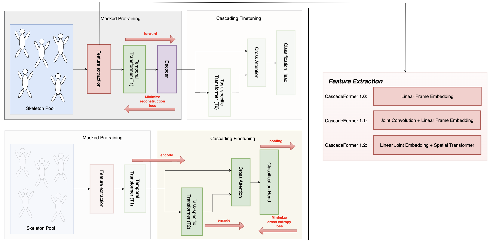

# 🌊 CascadeFormer: Two-stage Cascading Transformer for Human Action Recognition

## CascadeFormer Architecture

## Evaluation Results

| dataset | #videos | #joints | CF 1.0 | CF 1.1 | CF 1.2 |
| ------- | ------- | ---------- | ------ | ------- | ------ |
| Penn Action | 2,326 | 13, 2D | **94.66%** [checkpoint](https://drive.google.com/drive/folders/1Za50ZE9ZEKdEps_ZE-JIbatTpLuMW83k) | **94.10%** [checkpoint](https://drive.google.com/drive/folders/1qbcT8DlhNyT3HgbM3j2aEQP2rSXoEJRS) | **94.10%** [checkpoint](https://drive.google.com/drive/folders/1Jl7lIVcbqw6W2xzvf09nVRERXHIFrjXn) |
| N-UCLA | 1,494 | 20, 3D | **89.66%** [checkpoint](https://drive.google.com/drive/folders/1ncVqXBd2P-SMDD_OCZaGyEti2LVfwiw8) | **91.16%** [checkpoint](https://drive.google.com/drive/folders/1b0IuO_XY-Gwv4RjS6gF9gPG36uvGwhha) | **90.73%** [checkpoint](https://drive.google.com/drive/folders/1IPSW5pz_Sn0dfywP2RatlnlrfVzPJNvB) |
| NTU/CS | 56,880 | 25, 3D | **81.01%** [checkpoint](https://drive.google.com/drive/folders/1eKcX4wE6UweV0EviHUPzltzivjYAHjeI) | **79.62%** [checkpoint](https://drive.google.com/drive/folders/1Tf0cpzBpg8bg7M1LpxHla40Fcdvp27DY) | **80.48%** [checkpoint](https://drive.google.com/drive/folders/1naON3aSNM_jzWuArKq2nEwlAjDiNbPu5) |
| NTU/CV | 56,880 | 25, 3D | **88.17%** [checkpoint](https://drive.google.com/drive/folders/1-VrOyJKEvCQig_S4HM4Tdae9S3Tsc5M_) | **86.86%** [checkpoint](https://drive.google.com/drive/folders/1iefjdPXuR_KiovzsPPzWqkeXdPB-yDIt) | **87.24%** [checkpoint](https://drive.google.com/drive/folders/14WOU0OGxWl0s-Q4b8GoZrdh6gJH--GIw) |

## Contacts

If you have any questions or suggestions, feel free to contact:

- Yusen Peng (peng.1007@osu.edu)
- Alper Yilmaz (yilmaz.15@osu.edu)

Or describe it in Issues.