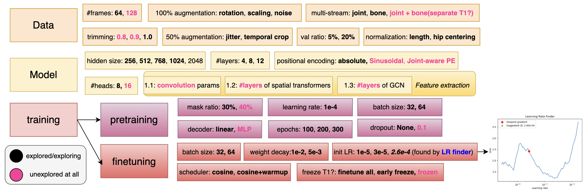

# 🌊 CascadeFormer: Two-stage Cascading Transformer for Human Action Recognition

## My hypothesis of the major bottlenecks so far

1. lack of spatial inductive bias - need to tune the spatial feature extraction **much MORE**!
2. still not sure how to use T1 during finetuning - frozen OR finetuned OR freeze-then-unfreeze?
3. spatial transformer is very unstable (collapse after overfitting):

```python
Epoch 87/100: LR = 0.000013, Train Acc = 0.9852, Val Acc = 0.7531
Epoch 88/100: LR = 0.000011, Train Acc = 0.9856, Val Acc = 0.7606
Epoch 89/100: LR = 0.000009, Train Acc = 0.7424, Val Acc = 0.0167
Epoch 90/100: LR = 0.000008, Train Acc = 0.0154, Val Acc = 0.0165
```

## CascadeFormer 1.X series


## Tuning Diagram



## Leaderboard

| dataset | #videos | #joints | SoTA acc | CF 1.0 | CF 1.1 | CF 1.2 | CF 1.3 |
| ------- | ------- | ---------- | ------- | ------ | ------- | ------ | ------- |
| Penn Action | 2,326 | 13, 2D | 93.4% (HDM-BG) | **94.66%** [checkpoint](https://drive.google.com/drive/folders/1Za50ZE9ZEKdEps_ZE-JIbatTpLuMW83k) | **94.10%** [checkpoint](https://drive.google.com/drive/folders/1qbcT8DlhNyT3HgbM3j2aEQP2rSXoEJRS) | **94.10%** [checkpoint](https://drive.google.com/drive/folders/1Jl7lIVcbqw6W2xzvf09nVRERXHIFrjXn); **94.01%** [checkpoint](https://drive.google.com/drive/folders/1jAlH7pf-zaHy7CVIF3MAmiZ5mMtDw2j-) | N/A |
| N-UCLA | 1,494 | 20, 3D | 98.3% (SkateFormer) | **88.79%** |**91.16%** [checkpoint](https://drive.google.com/drive/folders/1b0IuO_XY-Gwv4RjS6gF9gPG36uvGwhha); **90.52%** [checkpoint](https://drive.google.com/drive/folders/10v1zGGhziiRZdXO2mDU-db_keVmmeUNY) | **90.73%** [checkpoint](https://drive.google.com/drive/folders/1IPSW5pz_Sn0dfywP2RatlnlrfVzPJNvB) | N/A |
| NTU/CS | 56,880 | 25, 3D | 92.6% (SkateFormer) | **75.22%** | **74.10%** | **72.10%** | running |
| NTU/CV | 56,880 | 25, 3D | 97.0% (SkateFormer) | N/A | N/A | N/A | N/A |

## Ablation Study: bone representation (Penn Action and NTU/CS)

| dataset | #videos | #actions | dimension | #joints | outperform SoTA? |
| ------- | ------- | -------- | --------- | ---------- | ------- |
| Penn Action, subtraction-bone | 2,326 | 15 | 2D | 13 | **92.32%** ~ 93.4% (HDM-BG) |
| Penn Action, concatenation-bone | 2,326 | 15 | 2D | 13 | **93.16%** ~ 93.4% (HDM-BG) |
| Penn Action, parameterization-bone | 2,326 | 15 | 2D | 13 | **93.91%** > 93.4% (HDM-BG) |
| N-UCLA, subtraction-bone | 1,494 | 12 | 3D | 20 | **85.56%** < 98.3% (SkateFormer) |
| N-UCLA, concatenation-bone | 1,494 | 12 | 3D | 20 | **88.15%** < 98.3% (SkateFormer) |
| NTU/CS, subtraction-bone | 56,880 | 60 | 3D | 25 | **74.23%** << 92.6% (SkateFormer) - cross subject |
| NTU/CS, concatenation-bone | 56,880 | 60 | 3D | 25 | **73.81%** << 92.6% (SkateFormer) - cross subject |

## CascadeFormer 2.0 (interleaved spatial–temporal attention inspired by [IIP-Transformer](https://arxiv.org/abs/2110.13385) and [ST-TR](https://arxiv.org/abs/2012.06399))  


### result leaderboard - CascadeFormer 2.0

| dataset | #videos | #actions | dimension | #joints | outperform SoTA? |
| ------- | ------- | -------- | --------- | ---------- | ------- |
| Penn Action | 2,326 | 15 | 2D | 13 | **92.32%** = 93.4% (HDM-BG) |
| N-UCLA | 1,494 | 12 | 3D | 20 | 98.3% (SkateFormer) |
| NTU/CS | 56,880 | 60 | 3D | 25 | 92.6% (SkateFormer) |
| NTU/CV | 56,880 | 60 | 3D | 25 | 92.6% (SkateFormer) |

corresponding model checkpoints:

1. Penn Action: **92.32%** [google drive](https://drive.google.com/drive/folders/1cYQMhedWKBm93L9RWSEAj2HYGhdlucKl) - for Penn Action at least, it's very sensitive to overfitting! (sometimes fail to converge too...)
2. N-UCLA: TBD
3. NTU/CS: TBD
4. NTU/CV: TBD
